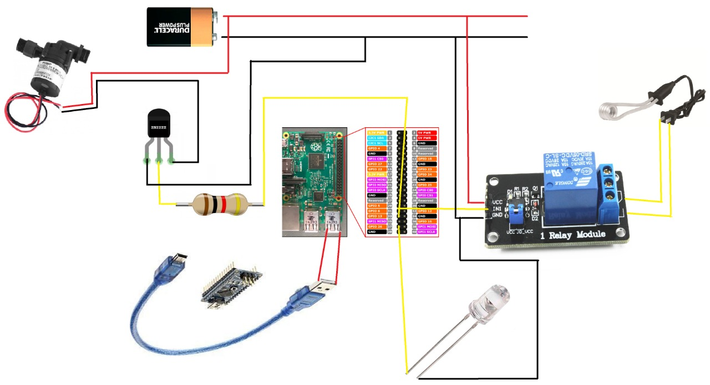

# UniCoffee

This guide will explain how to make use of our UniCoffee machine, so let's begin. This whole project was made in python 3.6.

## Prerequisites

First you need to clone or download this repository, after that open a command line and make sure you are inside the UniCoffee directory, then you need to install some dependencies to do that you can run:

    pip3 install -r requirement.txt

This command will install all the dependencies you need for this project.

## Important Parts

\-[Raspberry Pi 3 B+](https://www.raspberrypi.org/products/raspberry-pi-3-model-b-plus/) You can use any other version of the raspberry Pi but make sure it has Wi-Fi.

\-[Arduino Nano](https://store.arduino.cc/usa/arduino-nano) We use and Arduino because the IO pins of our raspberry Pi wasn't working as expected so we took the easy way and use this.

\-[Relay](https://www.ebay.com/itm/1-Channel-H-L-Level-Triger-with-Optocoupler-Relay-Module-Board-for-Arduino/191932860676?_trkparms=aid%3D555018%26algo%3DPL.SIM%26ao%3D1%26asc%3D40719%26meid%3Da4eb42bb8665470095a3853ce399bf5f%26pid%3D100005%26rk%3D2%26rkt%3D12%26mehot%3Dpf%26sd%3D142048984449%26itm%3D191932860676%26pmt%3D1%26noa%3D0%26pg%3D2047675&_trksid=p2047675.c100005.m1851) This relay was used to turn on and off the Electric Heater to boil the water

\-[Water Electric Heater Element](https://www.ebay.com/itm/Water-Electric-Heater-Element-Mini-Boiler-Hot-Water-Coffee-Immersion-Travel-Use/352811672624?_trkparms=aid%3D555018%26algo%3DPL.SIM%26ao%3D1%26asc%3D40719%26meid%3Df30f51265b754c8eaf6651e7fe775d2f%26pid%3D100012%26rk%3D3%26rkt%3D12%26sd%3D174017924627%26itm%3D352811672624%26pmt%3D1%26noa%3D0%26pg%3D2047675&_trksid=p2047675.c100012.m1985) This was used to boil the water inside the machine

\-[Servo](https://www.ebay.com/itm/High-Speed-MG995-Metal-Gear-Torque-RC-Servo-For-Airplane-Helicopter-Car-Boat/392264751153?_trkparms=ispr%3D1&hash=item5b54cd1831:g:~K8AAOSwoGxclgkY&enc=AQAEAAACQBPxNw%2BVj6nta7CKEs3N0qVHfzgj4W%2FxWfXF%2FrgmPKFximuktYP7xKf0Cca74kW6lXGSQaWwPUxtP0I8XM2t1U3ixOea0ulluSvjZpWXYtAoXFveTtvn5eGdoxfc8230kCH9k0MMCiXpN0gKO8butqUW65HsXBPSTajLYutUVJYA0bHgaeK9Q18ZXvs499hQN4F7pGMMoUoiuOFctwVD4YIodN86J34g9H%2BYj2iVjZweK9RKYr72ikUupfDJ8TE3CMVUCxfnkDuRPC9V0%2BD%2BGjJoDZRW2F3DztlHwpiG15lw%2BVVLMzAPD78G3WfpHuGt1Rpxa8KOQv0THCgJM93eqiyedyvrHz2n8rOIRo5%2BGbcI%2BuE453eYyied8%2B3EQruQAXxIl507aVf5xZA9xzKk6b8QD6G8lnu7MGGdN7OIjy2K2RKs93pZRHGyMpI7Ys%2Bv57fmSCEHcthfKmB736tooVvE8qyxHjCqwkbWMp6vRCiNt3vlLmJKwF5dliUavdLfjl%2FjdoQDexQUOM%2FU7CL4gSVPQl%2FSyyn99zVtULAzEUj2JYVBOdDtV35%2BuxO9I6Ubqny15ok7fbwrpr1P9GG9OFzlbAuo%2F7cQWx7nbo%2BGJX%2F9Uff%2BDskwvI9lZsqLFep%2BpSJpAixY07aZT7fHd02MS5MhmdjBz7%2FZugZRcloNlbn61lFlFQTgjZGG7bQyWt90f5XWhWjjS3IS%2BBcmNQWLQtc1DHvQHic38%2FuRy7LtK%2FPEtA1unM7mPx%2FJtL4HxAvafQ%3D%3D&checksum=392264751153ff3a9f0c92164f6b82b6963d0ab68fd3&enc=AQAEAAACQBPxNw%2BVj6nta7CKEs3N0qVHfzgj4W%2FxWfXF%2FrgmPKFximuktYP7xKf0Cca74kW6lXGSQaWwPUxtP0I8XM2t1U3ixOea0ulluSvjZpWXYtAoXFveTtvn5eGdoxfc8230kCH9k0MMCiXpN0gKO8butqUW65HsXBPSTajLYutUVJYA0bHgaeK9Q18ZXvs499hQN4F7pGMMoUoiuOFctwVD4YIodN86J34g9H%2BYj2iVjZweK9RKYr72ikUupfDJ8TE3CMVUCxfnkDuRPC9V0%2BD%2BGjJoDZRW2F3DztlHwpiG15lw%2BVVLMzAPD78G3WfpHuGt1Rpxa8KOQv0THCgJM93eqiyedyvrHz2n8rOIRo5%2BGbcI%2BuE453eYyied8%2B3EQruQAXxIl507aVf5xZA9xzKk6b8QD6G8lnu7MGGdN7OIjy2K2RKs93pZRHGyMpI7Ys%2Bv57fmSCEHcthfKmB736tooVvE8qyxHjCqwkbWMp6vRCiNt3vlLmJKwF5dliUavdLfjl%2FjdoQDexQUOM%2FU7CL4gSVPQl%2FSyyn99zVtULAzEUj2JYVBOdDtV35%2BuxO9I6Ubqny15ok7fbwrpr1P9GG9OFzlbAuo%2F7cQWx7nbo%2BGJX%2F9Uff%2BDskwvI9lZsqLFep%2BpSJpAixY07aZT7fHd02MS5MhmdjBz7%2FZugZRcloNlbn61lFlFQTgjZGG7bQyWt90f5XWhWjjS3IS%2BBcmNQWLQtc1DHvQHic38%2FuRy7LtK%2FPEtA1unM7mPx%2FJtL4HxAvafQ%3D%3D&checksum=392264751153ff3a9f0c92164f6b82b6963d0ab68fd3) This servo worked as a dispenser for the coffee

\-[Plastic Containers](https://www.ebay.com/itm/Clear-Plastic-Tamper-Proof-Tubs-Pot-Buckets-Storage-Containers-Lid-120ml-1L/113718926885?hash=item1a7a2d1e25:m:mNJxIUSpRXdgvcXDwsYz2Lg) Container for the water and the coffee

\-[Water Pump](https://www.ebay.com/itm/12V-3m-240L-H-Ultra-Quiet-Brushless-Motor-Submersible-Pool-Water-Pump-Solar-RF/173890788739?hash=item287cb2dd83:g:3-kAAOSw99tcGv-9) To push the water to the cup

## Building

 This are the connection you need to make to build the coffee machine.

## Programming

To star running the program you need to make some changes to the code

-   [ ] Program the Arduino Nano with the [Servo](Servo.ino) file.
-   [ ] In run.py you need to change the value of the host variable to your IP.
-   [ ] Make sure to change the name of the port you are using for the Arduino in the /flaskblog/users/utils.py
-   [ ] When working on the raspberry directly you can uncomment the imports and the serve_coffe() and pay attention to the pins used for the control of the heater and the pump.
-   [ ] You need to fill your email and password in the flaskblog/config.py file
-   [ ] There is already an Admin user created, email is admin@gmail.com and password is admin. You can change this anytime you want.

## Running the app
The only thing you need to do now is to run this command:
   
    python3 run.py
